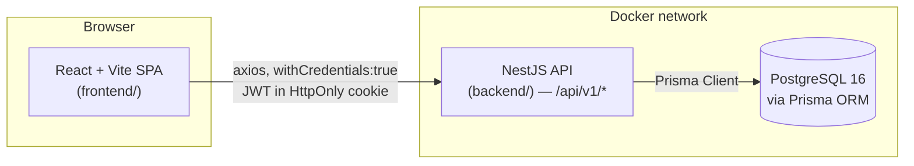
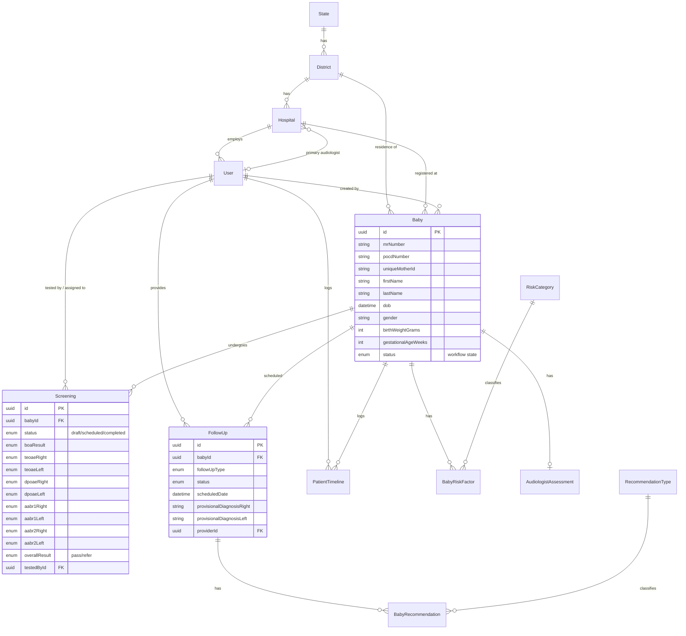

# AIISH NHSMS — System Architecture & Workflow Documentation

## 1. System Architecture

The application is a classic three-tier system: a React SPA, a NestJS REST API, and a PostgreSQL database, all orchestrated via Docker Compose for local development.



- **Frontend** (`frontend/`): React 18 + Vite + TypeScript, React Query for server-state caching, react-hook-form + zod for forms, Tailwind for styling, Recharts for charts. All HTTP calls flow through a single axios instance (`frontend/src/services/apiClient.ts`) and a per-domain service layer (`frontend/src/services/api/*.ts`).
- **Backend** (`backend/`): NestJS 10, versioned REST API under `/api/v1`, JWT auth stored in an HttpOnly cookie (not localStorage — mitigates XSS token theft), global `ValidationPipe` (whitelist + transform), a global exception filter producing a uniform error shape, Swagger docs at `/api/docs` (non-production only).
- **Database**: PostgreSQL 16, schema owned by Prisma (`backend/prisma/schema.prisma`), migrations in `backend/prisma/migrations/`.

## 2. Database Schema (ER Diagram)



Key design decisions (see inline comments in `schema.prisma` for the authoritative rationale):
- **Soft deletes** on `Baby` and `User` (`deletedAt`/`deletedById`) — no hard deletes of clinical records.
- **`Screening.overallResult`** (outcome) is deliberately separate from **`Baby.status`** (case workflow) and from **`Screening.status`** (draft/scheduled/completed workflow of the screening record itself) — three independent state machines that must not be conflated.
- **`Hospital.primaryAudiologistId`** is a nullable FK to `User` (not a free-text field or a separate `Audiologist` entity) — reuses the existing login/account system.
- All master data (`State`, `District`, `RiskCategory`, `RecommendationType`) is seeded via `backend/prisma/seed.ts` and never hardcoded in the frontend.

## 3. API Flow (Frontend ↔ Backend)

1. Frontend calls go through `apiClient` (`frontend/src/services/apiClient.ts`), an axios instance with `withCredentials: true` and `baseURL: ${VITE_API_URL}/api/v1`.
2. Each domain has a service file (`childrenService`, `screeningsService`, `followUpsService`, `hospitalsService`, `districtsService`, `audiologistsService`, `mastersService`, `dashboardService`, `analyticsService`) that:
   - Calls the matching NestJS controller route.
   - Maps between the frontend's `Child`/`Screening`/`FollowUp`/`Hospital` shapes and the backend's `Baby`/`Screening`/`FollowUp`/`Hospital` JSON (see `frontend/src/services/api/mappers.ts`) — e.g. `hospitalNumber` (frontend) ↔ `mrNumber` (backend), `dateOfBirth` ↔ `dob`, `contactNumber` ↔ `phone1`.
3. On the backend, every mutating field that identifies *who* performed an action (`testedById`, `providerId`, `createdById`, `deletedById`) is derived from the JWT payload via `@CurrentUser()` — never accepted from the request body. This closes a class of bugs where a client could impersonate another staff member.
4. Errors: the backend's `HttpExceptionFilter` returns `{statusCode, message, error, timestamp, path}` for every failure; the frontend's axios response interceptor normalizes this into a plain `Error` with a readable `.message`, and a 401 triggers an automatic redirect to `/login`.

## 4. Full User Workflow

```mermaid
sequenceDiagram
    actor Staff
    participant FE as Frontend
    participant BE as Backend
    participant DB as PostgreSQL

    Staff->>FE: Enter email/password
    FE->>BE: POST /auth/login
    BE->>DB: find User, bcrypt.compare
    BE-->>FE: Set-Cookie access_token (HttpOnly JWT)
    FE->>Staff: Redirect to Dashboard

    Staff->>FE: Register Child (7-step form)
    FE->>BE: POST /babies (+ risk factors + assessment)
    BE->>DB: insert Baby, BabyRiskFactor[], AudiologistAssessment
    BE-->>FE: Baby record

    Staff->>FE: New Screening
    FE->>BE: POST /screening (draft or completed)
    BE->>DB: insert Screening; if completed, update Baby.status + PatientTimeline
    BE-->>FE: Screening record

    Staff->>FE: Schedule Follow-up (if referred)
    FE->>BE: POST /follow-up (+ recommendations)
    BE->>DB: insert FollowUp, BabyRecommendation[], PatientTimeline
    BE-->>FE: FollowUp record

    Staff->>FE: View Analytics
    FE->>BE: GET /dashboard/analytics
    BE->>DB: aggregate Baby/Screening/FollowUp
    BE-->>FE: gender/state/district/hospital performance
```

**Login → Register Child → Screening → Follow-up → Analytics**, in detail:

1. **Login**: `POST /auth/login` validates credentials, issues an HttpOnly JWT cookie. `GET /auth/me` re-hydrates the session on page reload (frontend never reads the cookie directly).
2. **Register Child**: a 7-step form (`RegisterChildPage.tsx`) capturing every field on the paper datasheet — Child Info, Parent Info, Hospital Info (State→District→Hospital→Audiologist cascade), Socio-Demographics, High-Risk Register (medical professional's checklist, fetched live from `RiskCategory`), Audiologist's Assessment (family history, consanguinity, caregiver concern, 5 newborn reflexes), Additional Notes. Autosaves to `localStorage` every 30s and offers to restore an interrupted session.
3. **Screening**: staff pick a child from the Screening Queue or Children Registry and open `ScreeningFormPage.tsx`, which records ENT findings, BOA, TEOAE/DPOAE (1st screening), AABR (1st and 2nd screening) per ear, and an overall Pass/Refer result. Can be saved as a **draft** and resumed later, or **completed** (which updates the child's case status and logs a timeline event).
4. **Follow-up**: for a REFER outcome, staff schedule a follow-up (`FollowUpDialog.tsx`) with a type (Phone/Regular/Not applicable), provisional diagnosis per ear, and recommendations (fetched live from `RecommendationType`).
5. **Analytics**: the Dashboard and Analytics pages surface gender distribution, urban/rural split, and state/district/hospital performance, all computed server-side from live data (`GET /dashboard/analytics`) — no client-side aggregation of raw records.

## 5. Data Flow Summary

Every list/detail page follows the same pattern: React Query calls a service function → the service calls `apiClient` → NestJS validates the request (`ValidationPipe` + DTOs) → the service layer queries Prisma (with `include`d relations to avoid N+1 client-side joins) → the controller returns denormalized JSON (e.g. a `Baby` response already includes `district`/`state`/`hospital` names, not just IDs) → the frontend mapper reshapes it into the `Child`/`Screening`/etc. type → the component renders it. Mutations invalidate the relevant React Query cache keys so dependent views (Dashboard, Screening Queue, Child Details) refresh automatically.

## 6. APIs Used, Per Page

| Page | Backend endpoints used |
|---|---|
| Login | `POST /auth/login` |
| Dashboard | `GET /dashboard/overview`, `/activity-timeline`, `/upcoming-follow-ups`, `/notifications`, `/analytics` |
| Children Registry | `GET /babies`, `GET /screening` |
| Register Child | `GET /masters/districts`, `/masters/hospitals`, `/masters/audiologists`, `/masters/risk-categories`; `POST /babies` |
| Child Details | `GET /babies/:id`, `/babies/:id/timeline`, `/screening/by-baby/:id`, `/follow-up/by-baby/:id`, `/masters/audiologists`; `DELETE /follow-up/:id` |
| Screening Queue | `GET /screening`, `/babies`, `/masters/hospitals`, `/masters/audiologists` |
| Screening Form | `GET /babies/:id`, `GET /screening/:id`; `POST`/`PATCH /screening` |
| Follow-ups | `GET /follow-up`, `/babies`; `PATCH /follow-up/:id/status`, `/reschedule`; `DELETE /follow-up/:id` |
| Hospitals Directory | `GET /masters/hospitals`; `POST`/`PATCH`/`DELETE /masters/hospitals/:id` (admin) |
| Hospital Details | `GET /masters/hospitals/:id`, `/babies`, `/screening`, `/follow-up`, `/masters/audiologists` |
| Analytics | `GET /dashboard/analytics` |

## 7. Local Setup Instructions

Prerequisites: Docker Desktop, Node.js ≥22.

```bash
# 1. Start PostgreSQL (and optionally the full stack)
docker compose up -d postgres

# 2. Backend: install deps, apply schema, seed demo data, run
cd backend
npm install
npm run migrate:dev      # applies/creates migrations against the running Postgres
npm run seed             # idempotent — seeds states/districts/hospitals/users/master data/demo babies
npm run start:dev        # http://localhost:3001, Swagger at /api/docs

# 3. Frontend (separate terminal)
cd frontend
npm install
npm run dev               # http://localhost:3000
```

Demo credentials (from `backend/prisma/seed.ts`):
- Admin: `admin@aiish.in` / `Admin@12345`
- Audiologist: `audiologist@aiish.in` / `Audiologist@123`

Alternative: `docker compose up -d` runs all three services (Postgres, backend, frontend) together — the backend container runs migrations/seed automatically on startup via its entrypoint script.
